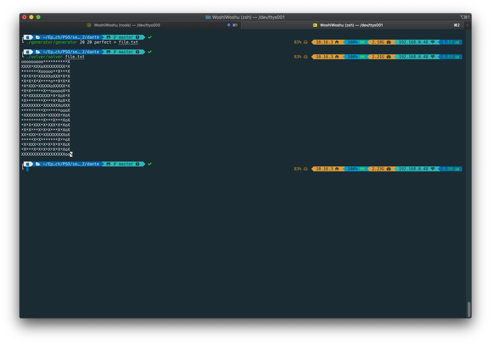

# CPE_dante_2017
First year mini project in C in which the goal is to generate and solve a maze. A folder with a binary named 'generator' will output a maze into a file.txt. Another folder with a binary named 'solver' will solve the maze (file.txt) while printing its output to the standard ouput. For a single maze, the ‘X’s represent the walls and the ’*’s represent the free spaces. “Start” is in the upper left-handcorner (0;0). “Finish” is in the bottom right-hand corner. The solution path is represented by a 'o' line.
The generator is based on Kruskal's algorithm and the solver on backtracking algorithm.

USING :

    Make

    ./generator/generator x y [perfect] > file.txt

    (To print the maze generator ouput on standard ouput instead on file ouput : ./generator/generator x y [perfect])

    ./solver/solver file.txt

NOTE :

    - A perfect maze is a maze that has no loops and no clusters; therefore, following a wall makes us cross the entire maze.

    - An imperfect maze must contain clusters.

